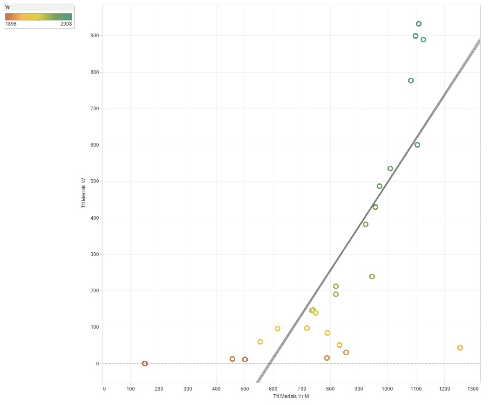

```{r message = FALSE}
require("jsonlite")
require("RCurl")
require(extrafont)
require(ggplot2)
require(tidyr)
require(dplyr)
```

## Procedure for getting our csv data onto Oracle.

#### 1. Require packages.

  

#### 2. Modify R_ETL.R: set working directory and file path, read our csv, use str() to determine which variables are continuous, and change measures accordingly. 

#### 3. Run the code to get the SQL CREATE TABLE command. 

      

#### 4. Use the command to create a table in SQL Developer to create a new table. 

     

#### 5. Open the table, click "Actions," and "Import Data..." 

      
      

#### 6. Follow through the data import wizard (Match by Name)

      

#### 7. All data from the csv file data should now be entered into the SQL table you created.

      
  
### Data Frame (Olympics)

```{r tidy = TRUE}
source("../01 Data/olympicsdataframe.R", echo = TRUE)
```


## Visualizations
#### Barchart

    

Procedure:  
* Columns : ATTR(Total Metals Country Overall)  
* Rows : Country  
* Marks : Text -> ATTR(Total Metals Country Overall)  
* Reference Line : Average of 184  

Analysis:   
This barchart shows the total number of medals a country has won throughout all the games each country has participated in, and a reference line that shows the average number of medals.  

#### Boxplot

  
  
Procedure:    
* Columns : Country  
* Rows : Year  
* Filters : Counter -> East Germany, Germany, Russia, Soviet Union, West Germany  

Analysis:   
This boxplot shows the years during which a country participated in the Olympics. This graph accurately shows the period Germany broke up into East and West Germany as well as the year in which the Soviet Union became Russia.   


#### Histogram

   

Procedure:  
* Columns : Year (bin)  
* Rows : CNT(Year)  
* Filters : Year -> 1896-2008  
* Marks : Color -> Metal : Bronze, Silver, Gold  
	      Text -> Host City

Analysis:   
This histogram shows the number of medals awarded at each edition of the Olympics. We can see an increase in the medals given out, meaning that the games expanded to include a larger variety of sports. 
The 1916 Olympics, scheduled to be held in Berlin, Germany; were cancelled due to WW1.
The 1940 and 1944 games were cancelled due to WW2.   
  
#### Scatterplot

    

Procedure:  
* (2 green things - measures)  
* Columns : Total Metals Per Year Men  
* Rows : Total Metals Per Year Women  
* Marks : Color -> Year : 1896-2008  
* Add a trend Line  

Analysis:   
The scatterplot shows how the ratio of medals won by women to the medals won by in a given year progressed throughout the history of the Olympic Games. 
This plot shows that women did not participate during the first Olympic games at Athens. The ratio started out low when Women began to compete, and slowly increased. 
This tells us that the Olypics began to incorporate more sports for women to compete in.   

#### Crosstab map with KPI

  

Procedure:  
* Columns : Longitude  
* Rows : Latitude  
* Filters : Country -> Excluded US and Soviet Union (outliers)  
* Marks : Color -> AGG(Country Metal KPI) : Red to Green  
* Filled Map  
* KPI determined by SUM(Total Metals Country Overall) / 184. 184 is the average amount of number of metals won per country.  

Analysis:   
This map shows the total number of medals won by each country throughout the history of the Olympics, relative to all other participating countries.

*The US and Soviet Union are excluded as they had won far more than the other countries.   
  
## Shiny App:
 
   

https://ronly.shinyapps.io/DV_FinalProject  


